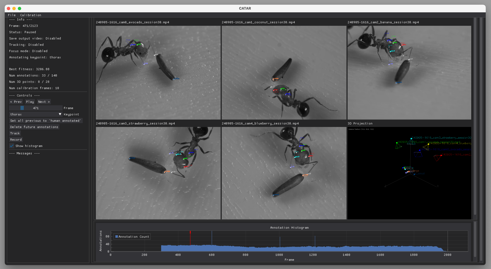

# CATAR

## Key bindings :computer:

| Key  |  Action |
|---|---|
| <kbd>Space</kbd> | Play / Pause video playback |
| &#8592; / &#8594;| Go to previous or next frame |
| &#8595; / &#8593; | Cycle through keypoints to annotate |
| T | Toggle Lucas-Kanade optical flow tracking |
| H | Mark all previous annotations for the selected point as "human annotated" |
| D | Delete all future annotations for the selected point (in focus mode) |
| Z | Toggle "Focus mode" (hides other points and isolates tracking) |
| C | Add current frame to the calibration set |
| G | Start / Stop the genetic algorithm for calibration |
| F | Jump to annotation with worst reprojection error |
| W | Jump to frame with highest total reprojection error |
| R | Toggle save recording the UI to an recording.mp4 file (slow) |
| S | Save current state (annotations, camera parameters) |
| L | Load last saved state |
| Q | Quit |

## Built with :hammer:

- [DearPyGui](https://github.com/hoffstadt/DearPyGui) - GUI toolkit for Python
- [OpenCV](https://pypi.org/project/opencv-python/)
- [NumPy](https://numpy.org/)
